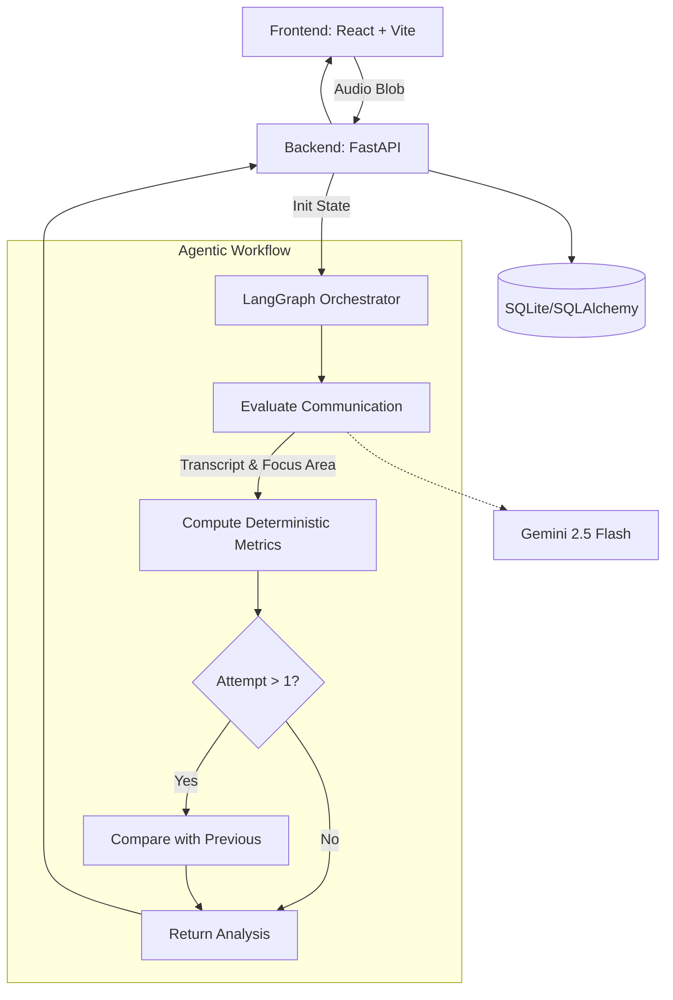

<div align="center">
  <br />
  
  <h1 align="center">Adaptive Communication Intelligence Coach</h1>
  <p align="center">
    <strong>An evidence-based, agentic communication coaching platform.</strong>
    <br />
    <br />
    <a href="https://github.com/SehrishMajeed/adaptive-communication-coach/issues">Report Bug</a>
    ·
    <a href="https://github.com/SehrishMajeed/adaptive-communication-coach/issues">Request Feature</a>
  </p>
</div>

<div align="center">
  
  
  
  
  
</div>
<br />

## 📖 The Problem
People practice speaking repeatedly without knowing what exactly is weak, what they should improve first, or whether they actually improved. Typical AI feedback tools provide one generic response and the conversation ends. There is no evidence, no retry loop, and no persistence.

**Aura Coach solves this.** It provides deterministic metrics, qualitative AI evaluation, and a cyclical retry loop based on targeted focus areas.

## ✨ 30-Second Use Case
1. **0–5s**: Open the practice screen.
2. **5–10s**: Record a 60-second response to a scenario (e.g., "Explain a technical project to a non-technical person").
3. **10–16s**: View deterministic metrics (WPM, filler words) and qualitative AI evaluation (Clarity, Structure).
4. **16–21s**: Review the selected highest-impact focus area and a targeted next exercise.
5. **21–26s**: Retry the exercise and view the comparison delta.
6. **26–30s**: Your persistent progress profile updates based on evidence.

## 🧠 What Makes It Agentic?
This is not a single LLM call. It is a stateful coaching workflow orchestrated by **LangGraph**. The system validates transcripts, computes metrics, evaluates rubrics, updates persistent skill profiles, and routes retry attempts conditionally based on previous session state.

### System Architecture



## 🛡️ AI / Deterministic Boundaries
- **Deterministic (Python)**: Audio duration, word count, words per minute (WPM), and filler word counts are calculated natively. The LLM is **never** asked to hallucinate these numbers.
- **AI (Gemini via LangGraph)**: Qualitative rubrics (Clarity, Structure), feedback generation, and targeted exercise selection.

## 🚀 Getting Started

### Prerequisites
- Node.js (v18+)
- Python 3.10+
- Google Gemini API Key

### Local Setup

**1. Backend**
```bash
cd backend
python -m venv venv
source venv/bin/activate # Windows: venv\Scripts\activate
pip install -r requirements.txt

# Create environment variables
cp .env.example .env
# Edit .env and add your GEMINI_API_KEY

# Run server
uvicorn app.main:app --reload
```

**2. Frontend**
```bash
cd frontend
npm install
npm run dev
```

## 🌍 Production Deployment

### Frontend (Vercel)
The frontend is pre-configured for zero-config Vercel deployment via `frontend/vercel.json`.
1. Import the repository into Vercel.
2. Set the framework to `Vite`.
3. Add `VITE_API_BASE_URL` pointing to your deployed backend.

### Backend (Render / Railway)
The backend is ready for deployment on platforms like Render or Railway.
- **Start Command**: `gunicorn app.main:app -w 4 -k uvicorn.workers.UvicornWorker`
- **Environment Variables**: Set `GEMINI_API_KEY` and `CORS_ORIGINS`.

## 🔒 Security & Privacy
- API keys remain strictly server-side.
- Transcripts are explicitly delimited as untrusted data inputs.
- Audio recordings are processed ephemerally and not logged.
- The UI exposes no raw internal exceptions; errors are gracefully formatted.

## 🧪 Evaluation & Testing
- The LangGraph workflow is tested with deterministic Pytest fixtures.
- Attempt routing and comparison nodes are verified offline using mocked AI schemas to guarantee state transitions.

## 📌 Scope & Limitations
- MVP focuses exclusively on Audio/Transcript analysis (no video body language evaluation yet) to guarantee high-confidence feedback.
- Does not contain social features, communities, or generic "chat with AI" modes.

<br />
<div align="center">
  <i>Built with standard Software Engineering practices.</i>
</div>
