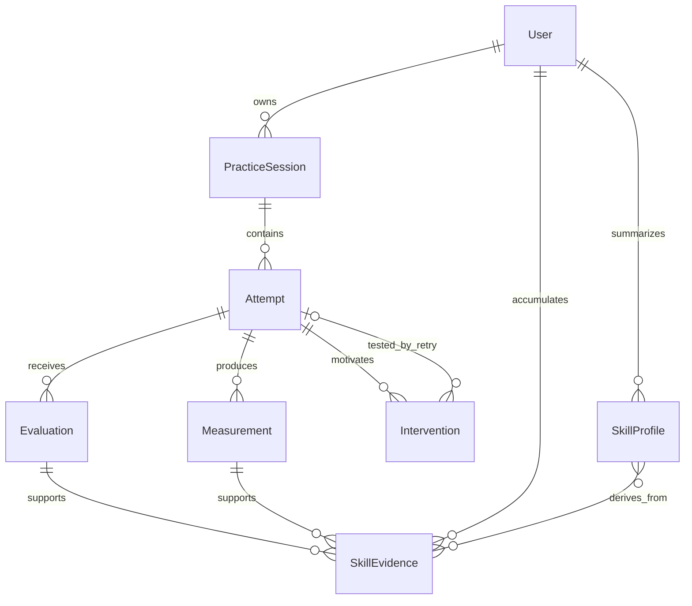

# Conceptual domain model

Proposed design only. No database changes or migrations are part of this audit. Existing `UserProfile`, `CoachingSession`, and `CoachingAttempt` are partial predecessors, not equivalent implementations.

## Entities and durable information

| Entity | Meaning | Persisted core fields |
| --- | --- | --- |
| User | An owned learner identity, separate from its skill estimate | Opaque ID, identity-provider linkage or secure anonymous ownership, creation/deletion state, consent/retention preferences; minimal personal data |
| PracticeSession | One communication task whose context remains stable across retries | ID, owner ID, topic/scenario, audience, goal, requested duration, language, task/rubric context version, created/completed times |
| Attempt | One submitted performance in a session | ID, session ID, sequence, parent/baseline attempt ID when applicable, idempotency key, processing status, actual duration provenance, timestamps, safe failure reason, transcript/version and retention metadata |
| Measurement | A reproducible observation derived from identified inputs | Attempt ID, metric name/version, value/unit, denominator, source/provenance, validity status; word count, elapsed duration, WPM and candidate-filler counts/rates |
| Evaluation | A versioned qualitative assessment, including abstention | Attempt ID, rubric/prompt/model versions, dimension scores with anchors, structured evidence references, quality flags, uncertainty signal, validation status, evaluation time, latency and available usage metadata |
| SkillEvidence | An eligible observation relating evaluation/measurement to one skill and context | User/attempt/evaluation IDs, skill ID, audience/task context, value, evidence reference, eligibility/abstention reason, estimator weight/version and timestamp |
| SkillProfile | A derived and rebuildable summary, not primary truth | User/skill/context key, estimator/version, supporting-evidence count, estimate, uncertainty or explicit unknown, last update, evidence cursor/version |
| Intervention | One prescribed exercise targeting one skill | Source attempt ID, target skill, diagnosis/evidence, exercise and completion instructions, version, expected observable change, assigned/completed state, retry attempt link and comparison outcome |

Use explicit null/unavailable values and statuses rather than interpreting zero as missing data. Persist comparisons as versioned structured outcomes attached to the intervention/retry (baseline ID, current ID, target, deltas, comparability reasons and verdict); a separate entity/table is optional initially.

An evidence row may be supported by a measurement, an evaluation, or both; enforce the relevant source constraint. The diagram is conceptual, not a prescription to create a join table for every link.

## Lifecycle and invariants

1. Create/resolve user ownership, then open a session with explicit task context. Changing audience, goal, or task creates a new session or explicit task version; do not compare it silently to a prior context.
2. Reserve a pending attempt idempotently. `(session_id, sequence)` and the scoped idempotency key are unique; identifiers alone do not establish access rights.
3. Process the upload outside a long-held database transaction. Status moves pending → processing → completed, abstained, invalid, or failed. Failed/invalid attempts can remain for safe diagnostics without becoming skill evidence.
4. Save versioned measurements and evaluations, including invalid/unavailable outcomes where useful. Re-evaluation creates a new version and supersedes eligibility deliberately; it must not double-count the same recording as independent skill evidence.
5. Establish a baseline only from eligible data; assign one active main intervention. Retry links to that task and intervention. Compare the declared target with comparable measurements/rubric versions, reporting improved, no clear change, regressed, or insufficient evidence.
6. Update skill summaries only from eligible, nonduplicated evidence. A single task's repeated attempts are correlated; do not inflate confidence as though each were an independent task. Store enough provenance to rebuild profiles and explain abstention.
7. Complete/abandon the session independently of attempt count. Retention/deletion removes sensitive content and triggers evidence/profile recomputation or invalidation according to policy, including dependent quotes and exports.

Foreign keys, non-null fields, finite/range checks, transactional writes, timestamps and authorization checks belong in the implementation plan. Design legacy migration explicitly: shared demo ownership is not attributable to real individuals, and historic filler counts/durations cannot be assumed correct.

## Ephemeral versus persistent

Ephemeral: raw local video, uploaded audio, temporary decoded media, live streams, object URLs, provider request payloads, graph state carrying raw bytes, temporary buffers and unvalidated model output. Explicitly clean resources on every terminal path. Do not checkpoint raw media merely to make workflow debugging convenient.

Persistent under consent/retention controls: task context, user-owned transcripts when needed for review/evidence, minimal evidence excerpts, measurements, bounded evaluations, interventions, comparisons and aggregate provenance. A transcript is sensitive durable content even if audio is deleted. Offer transcript minimization; if source text expires, mark evidence as no longer independently re-verifiable rather than claiming full auditability.

Operational records should contain request IDs, statuses, timings, prompt/model versions, token/audio usage where available and safe error categories. They should not contain raw recordings, full prompts with personal content, transcripts or secret values by default.
