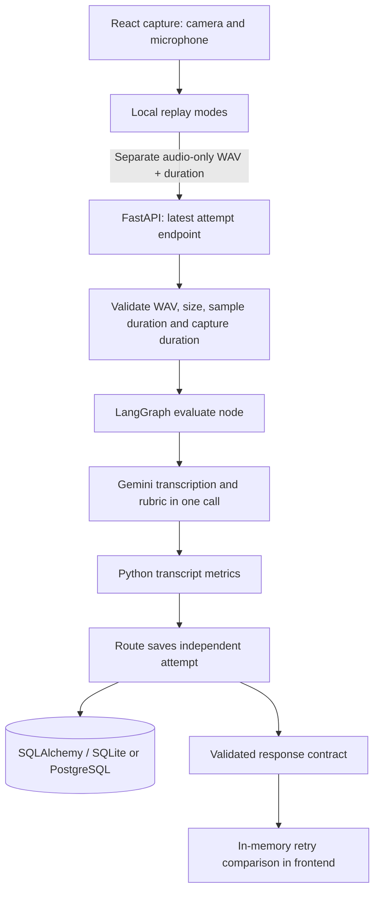
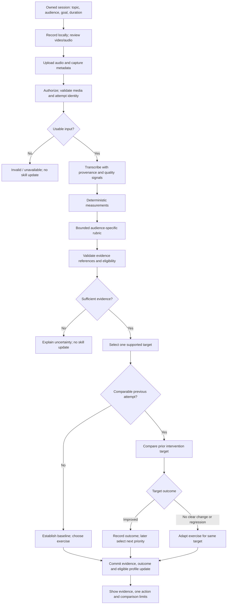

# Target architecture

Status: target design with current implementation notes. This is the canonical backend/system architecture document; Android delivery is covered in [Android-first system design](android-first-system-design.md). See [audit](current-state-audit.md), [domain model](domain-model.md), and [ADRs](adr/README.md).

## Current architecture

This is a modular prototype in one backend process. The graph neither validates evidence nor updates the profile. There is no worker, object store, history API, migration system, or authentication layer. The current retry comparison is frontend memory only, not durable coaching state. Manual Chrome/DevTools verification remains required before claiming the live privacy path is fully verified.

## Target: one modular application

Keep FastAPI, Python domain functions, SQLAlchemy and a small LangGraph. Keep Gemini behind a provider interface. The web React client remains a prototype; the product client should become Android-first after durable backend sessions exist. No new infrastructure is justified by the current evidence. Begin with bounded request processing; add durable background jobs only if measured processing times or disconnect recovery demand them.

| Layer | Responsibility | Must not own |
| --- | --- | --- |
| Frontend | Explicit task context, capture lifecycle, local video review, audio upload, request/error states, evidence and retry display | Model keys, authoritative scores, user ownership, durable skill calculations |
| API/application service | Identity, authorization, payload limits, request schema, idempotency, transaction boundaries, response contract | Prompt-specific reasoning or hidden heuristic scoring |
| Domain | Measurement definitions, evidence eligibility, comparable-attempt rules, deltas, target selection policy and skill update rules | HTTP, provider SDK, UI formatting, uncontrolled database commits |
| Provider adapter | Transcription/qualitative interpretation, structured response parsing, bounded call policy, usage metadata | Duration arithmetic, attempt numbering, aggregate updates, access control |
| Workflow | Typed state transitions, quality gates, baseline/retry branches, abstention and intervention outcome routing | Reinvented metrics, identity, raw SQL or autonomous code changes |
| Database/repositories | Owned durable entities, relationships, uniqueness, versioned evidence, atomic writes and recovery | Unqualified AI output as truth or raw conversational memory |

Keep schema translation explicit at the HTTP and persistence boundaries. Prefer narrow Pydantic/domain result types over `Dict[str, Any]`; derive or contract-test frontend types against backend responses. Define the rubric scale once and retain rubric version. A display transformation must not rename the construct being measured.

## Domain model

The [domain model](domain-model.md) defines User, PracticeSession, Attempt, Measurement, Evaluation, SkillEvidence, SkillProfile and Intervention, including relationships, persisted fields and lifecycle invariants. A session fixes topic, audience and goal; retries compare the earlier intervention's target within that context. Profiles summarize eligible evidence rather than raw conversation history.

## Target product flow

Select topic, audience, communication goal and duration → record → review full replay, muted presence and audio-only voice → measure → evaluate → validate evidence → diagnose one weakness → prescribe one exercise → retry the same task → compare the targeted skill → update eligible long-term evidence. Distinguish observable within-session change from proof of causal learning.

## Proposed data flow

This graph describes logical stages, not a requirement for a separate service or model call at every box. Transcription and evaluation may initially share a provider call if raw transcript fidelity and evidence validation remain testable. Measurements dependent on transcription cannot run before it; do not parallelize dependent stages. Input validation happens before expensive calls. Retry comparison evaluates the **previous intervention's target**, not whichever new focus happens to be suggested.

## Deterministic / AI boundary

Code measures duration from validated media, counts tokens and candidate fillers from a specified transcript, derives rates and deltas, and manages attempt numbers and profile updates. Duration must never be inferred from compressed byte count. Pauses need measured timestamps; omit them until supported.

AI proposes clarity, structure, conciseness, audience adaptation, and explanation-quality judgments within a versioned rubric. Evidence references must resolve to the analyzed transcript; literal span validity is necessary but does not prove that an interpretation is warranted. Human evaluations test that second condition. Model-reported confidence is a separate uncalibrated signal until experiments establish its meaning.

Do not claim filler absence when transcription may have removed disfluencies. Persist transcript provenance, metric/rubric versions and eligibility so results can be audited and recomputed. Distinguish input quality, evaluator uncertainty, and observed skill level.

Current PR 3C implementation records three explicit evaluator quality statuses on every durable practice evaluation: `input_quality`, `evidence_status`, and `feedback_status`. The frontend renders them as visible trust notes so users and reviewers can see whether feedback was actionable, quote-supported, or abstained instead of silently trusting AI output.

Current PR 3D implementation adds the first coaching quality gate: only evaluations with `evaluator_status=completed`, `input_quality=usable`, `evidence_status=quote_verified`, `feedback_status=actionable`, and a supported focus may create interventions or retry comparisons. Abstained or limited-quality attempts can still be saved for review, but they cannot masquerade as coaching progress.

Current Phase 4A implementation moves this decision into `backend/app/domain/coaching.py`. The API route still owns HTTP, authorization and database writes, but the coaching engine now owns eligibility, target extraction, deterministic drill mapping and comparison verdict thresholds.

Current Phase 4B implementation adds explicit attempt workflow routes in the same domain module: `abstained`, `baseline`, `baseline_blocked`, `retry_without_baseline`, `retry_blocked`, and `retry_comparable`. The route code now asks the coaching engine which path applies before creating interventions or comparisons.

Current Phase 4C implementation returns the chosen workflow route in session-scoped attempt responses and renders it as a subtle coaching-engine note in the feedback UI. Reviewers can now see when the backend treated an attempt as baseline, abstained, blocked retry or comparable retry.

## Failure and transaction boundaries

- Reject unauthorized or invalid requests before processing; stable error codes distinguish invalid media, unavailable transcription, invalid evaluation, provider timeout and persistence failure. Frontend preserves a retryable local recording when appropriate.
- Reserve a pending attempt with an idempotency key and unique session sequence. Commit the reservation quickly; do not hold a database transaction across a model call. Finalize evidence/outcome and profile change atomically, or mark the attempt failed with a safe reason. Duplicate finalization must not update a profile twice.
- Use deadlines and bounded retries only for transient provider failures, accounting for duplicate call cost. A timeout is not a negative skill observation. No default scores or “good baseline” for empty input.
- Concurrent finalization uses database constraints and a deliberate serialization/versioning strategy. Clients cannot choose another user's baseline or overwrite evidence.
- Abstained evaluation may retain eligible deterministic measurements; it contributes no unsupported qualitative skill update. Unreliable transcription also invalidates transcript-derived metrics.
- Configure database/engine creation explicitly; migrate through a release step. Test SQLite locally and PostgreSQL behavior before claiming both are production-supported.

## Privacy boundary

Local video remains browser-local and is released on restart/unmount. Only the necessary audio is sent after clear disclosure. The application treats uploaded audio as ephemeral: bounded processing, temporary artifact cleanup in success/failure/cancellation paths, no durable blob column, no raw payload logging/tracing. HTTP multipart handling may spool bytes to temporary files; “ephemeral” is not a guarantee that bytes never touch disk.

External providers are a separate retention boundary. Document and verify selected account/provider settings before making deletion promises. Disable raw graph-state tracing by default; record redacted node timings, request IDs, versions and usage instead. Transcripts/evidence can contain sensitive project details, so apply ownership, retention limits, deletion/export and backup policies to them too. Quoted evidence still contains user content. Ask beta users to avoid confidential material until that policy is operational.

## LangGraph decision

Use conditional orchestration to make validation failure, baseline, comparable retry, abstention, and target outcome explicit and testable. Domain functions implement the work; application services own transactions. Checkpoints, if later required, must exclude raw media and sensitive traces unless deliberately protected and retained. Do not use LangGraph merely to wrap one model call, build multiple personas, or substitute graph state for durable domain records. If a future simplified workflow has no meaningful branching, ordinary application code remains a valid alternative.
